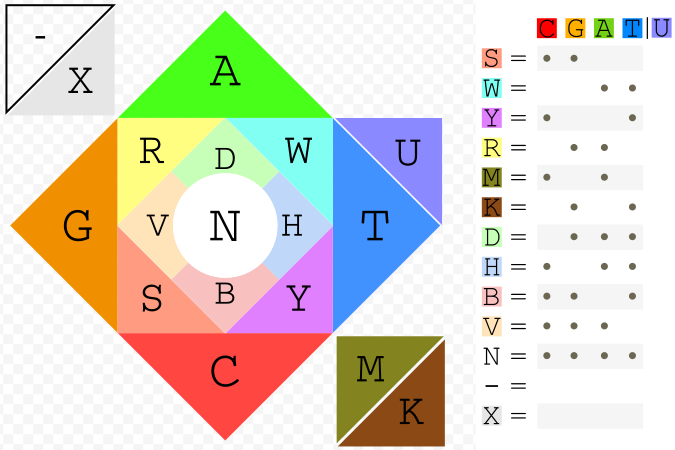
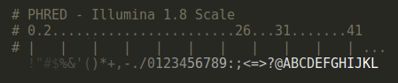
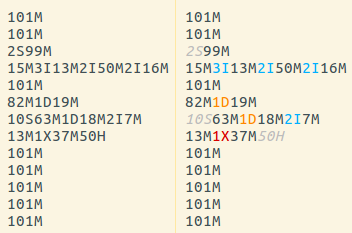

Grok your data

The objective of bioSyntax is to bring you closer to your data, giving you an [intuitive & empathetic](https://en.wikipedia.org/wiki/Grok) understanding of biology. To appreciate all that bioSyntax has to offer read this short manual (~10 minutes) and go explore.

1. [Getting Started](#getting-started) 
2. [Reading bioSyntax](#reading-biosyntax)
3. [Supported Formats](#supported-file-formats)
4. [Developing New Formats & Themes](#collaborate)

# Getting Started

### [See: Installing bioSyntax](https://biosyntax.org/install)

bioSyntax integreates seamlessly with **vim** *(Linux / Mac / Win)*, **sublime** *(Linux / Mac / Win)*, **gedit** *(Linux / Win)*, & **less** *(Linux / Mac)*. After installing bioSyntax files will automatically detected by file-extension.


### Reading large-data

For very large data sets, it's often slow to open them in a text editor. It's best to use the command-line program **less** which will read your file from a data-stream.

#### Read your large-data set with **less** directly

```
  # If your file is uncompressed, it can be read directly.
  # less will recognize the file extension (.XYZ)
  
  cd ~/myData/
  
  less dbSNP107_common.vcf
  
  less hg19.fa
```

#### Streaming your data directly into **less** with pipes `|`
  
```
  # If your file is compressed, you can 'pipe' the data 
  # using the "|" operator from decompression, directly into
  # less. You must prefix the file extension you want
  # as file formats are not recognized within streams.
  
  cd ~/myCompressedData/ 
  
  samtools view -h NA12878_hg38.bam | sam-less
  
  gzip -dc dbSNP107_rare.vcf.gz | vcf-less
  
  gzip -dc hg38.fa.gz | fa-less
```

#### Bypassing bioSyntax (data in plain-text)

For **vim**
Type `:syntax off` in vim

For **less**
  
```
  # You may want to view your data without syntax highlighting
  # such as where a file is improperly formatted or very large
  # files where syntax highlighting may be slow (i.e. VCF files
  # with hundreds of columns).
  
  # 1. Pipe your data through cat
  cat snp_1000genomes.vcf | less - 
  
  # 2. Within less, switch to a visual editor
  less snp_1000genomes.vcf
    # press 'CTRL-C' to stop process
    # press 'v' to switch to visual editor
```

# Reading Data

### Nucleotides

bioSyntax implements a novel, full [IUPAC Nucleotide Code](https://en.wikipedia.org/wiki/Nucleic_acid_notation#IUPAC_notation) coloring (Figure 1). Ambiguous bases are represented by an ~additive color-mixing of the parent bases. For example, **T**hymine (blue) + **C**ytosine (red) are both p**Y**rimidines (magenta).



An intuitive feature of the bioSyntax color scheme is that the 'GC-content' of a sequence can be quickly approximated by how warm (high GC, red-orange) or cool (low GC, blue-green) a sequence looks (Figure 2).
  


### PHRED Scores

When available, bioSyntax will highlight [PHRED quality scores](https://en.wikipedia.org/wiki/Phred_quality_score) in a step-gradient of blacks (PHRED = 0-10) to whites (PHRED = 40+) (Figure 3).



### CIGAR Strings

In `.sam` files the Query:Reference alignment is summarized efficiently but illegibly as a [CIGAR String](https://genome.sph.umich.edu/wiki/SAM#What_is_a_CIGAR.3F). With a little bit of highlighting these become much easier to read (Figure 4).



### Amino Acid Color Schemes

You can choose from several color-schemes for amino-acid fasta files. The `Fasta Clustal` (Default) syntax colors amino acids based on their [physiochemical properties](http://www.jalview.org/help/html/colourSchemes/clustal.html), so does `Fasta Hydrophobicity`, or you may prefer better discrimination of each amino acids with `Fasta Zappo` or `Fasta Taylor`.


# Support 

## Report a bug / Ask a question

The fastest way to get an answer is to:

1) Search / Open an issue on the bioSyntax Repo. 

Please Include:
- A detailed and descriptive title.
- Enough information about what did for someone else to replicate the problem.
- Information about the operating system / software you're using (`uname -a`)
- If it's a syntax highlighting issue: a screenshot of the error and a small bit of the input file you used.

2) If you really don't want to make a (fake) github account. Email [info@bioSyntax.org](mailto:info@bioSyntax.org) and we'll open the issue, but it will be slower.


# Collaborating on bioSyntax

bioSyntax is a community-oriented project for scientific syntax highlighting. We encourage you to change and customize it to suit your needs.

Check out the [Development](https://bioSyntax.org/dev) page to create syntax-highlighting for custom file-formats and for other ways to help out.

# Supported File Formats

File format and software compatibility matrix for bioSyntax.

## Core bioSyntax

  File Format | Description                 | sublime | vim | gedit | less |
|:------------|:----------------------------|:-------:|:---:|:-----:|:----:|
| .fasta      | Generic nt/aa sequence      |    X    |  X  |   X   |   X  |
| .fastq      | Fasta + PHRED quality       |    X    |  X  |   X   |   X  |
| .clustal    | Multiple Sequence Alignment |    X    |  X  |   X   |   X  |
| .bed        | Genomic Ranges              |    X    |  X  |   X   |   X  |
| .gtf        | Genomic Annotation          |    X    |  X  |   X   |   X  |
| .pdb        | Protein Structure           |    X    |  X  |   X   |   X  |
| .vcf        | Variant Call Format         |    X    |  X  |   X   |   X  |
| .sam        | NGS Sequence Data           |    X    |  X  |   X   |   X  |

## Auxillary Syntaxes

| File Format | Description                 | sublime | vim | gedit | less |
|-------------|-----------------------------|:-------:|:---:|:-----:|:----:|
| .fasta      | fasta alternative AA colors |         |     |       |      |
| -           | Clustal                     |    X    |  -  |   X   | -    |
| -           | Taylor                      |    X    |  -  |   X   | -    |
| -           | Zappo                       |    X    |  -  |   X   | -    |
| -           | Hydrophobicity              |    X    |  -  |   X   | -    |
| .fai        | Fasta Index (faidx)         |    X    |  X  |   X   | X    |
| .flagstat   | samtools flag summary       |    X    |  X  |   X   | X    |
| .wig        | Wiggle data                 |    -    |  -  |   X   | -    |
| .pdbx       | Protein Structure (large)   |    -    |  -  |   -   | -    |
| .phylip     | Multiple Sequence Alignment |    -    |  -  |   -   | -    |
| .newick     | Tree Format                 |    -    |  -  |   -   | -    |
| [.nexus](http://informatics.nescent.org/wiki/NEXUS_Specification) |  Phylogenetics data | - | X | - | - |
| .cwl        | Common Workflow Language    |    -    |  -  |   -   | -    |

See Also: [Alternative/User Syntax Definitions](https://github.com/bioSyntax/bioSyntax/tree/master/alt-syntax)
